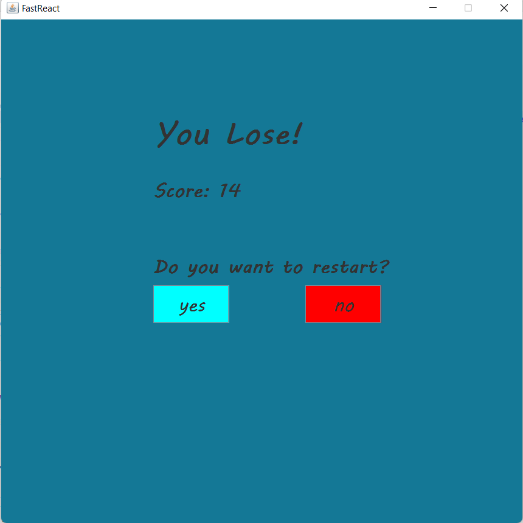
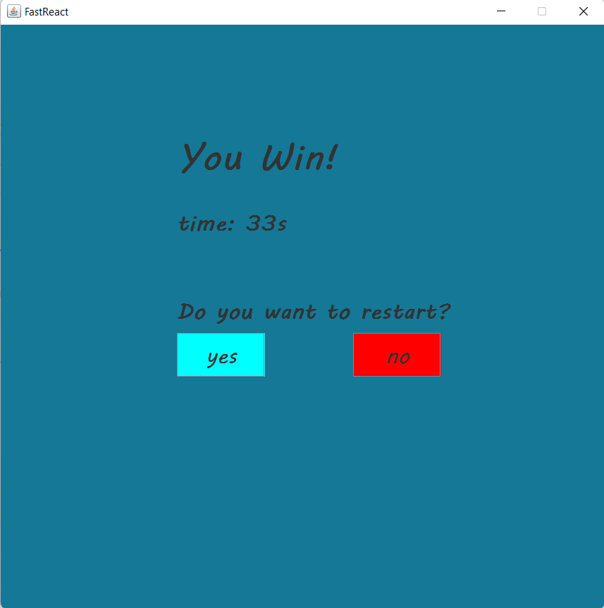

# FastReact

FastReact is a Java Swing game that tests your reaction and button-clicking skills. The objective is to find and click a series of buttons displayed on the screen before time runs out, buttons must be clicked in ascending order. Challenge yourself to complete the sequence in record time and achieve a high score!

## Features
- Welcome screen
- Engaging gameplay requiring quick reactions
- Randomized button placement for each session
- Timer to add a sense of urgency
- Score tracking to monitor your performance
- Game over screen with results and options to restart or exit

## How to Play

1. Click the "Play" button to start the game.
2. Buttons will appear on the screen. Click them in ascending order.
3. Finish before the timer runs out.
4. If you click the wrong button or run out of time, the game is over.
5. View your score and choose to restart or exit.

## Screenshots

### Prerequisites

- Java Development Kit (JDK)
- Java Swing library

### Installation

1. Clone the repository:
2. Compile the Java source files:
3. Run the game:

## Contributing

Contributions are welcome! If you have any ideas, bug fixes, or improvements, feel free to open an issue or submit a pull request.
